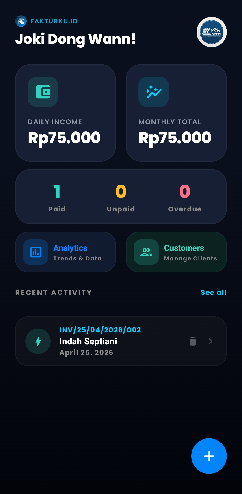
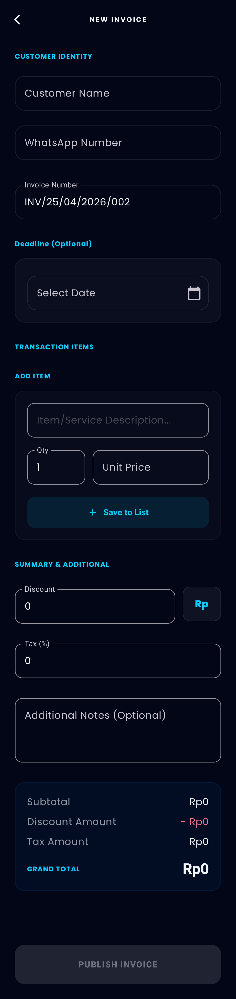
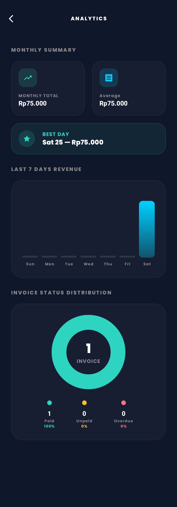
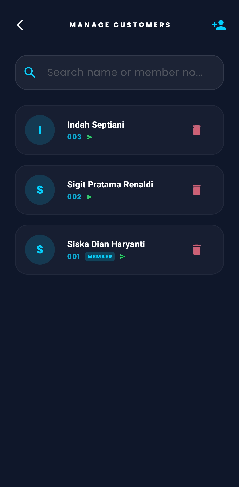
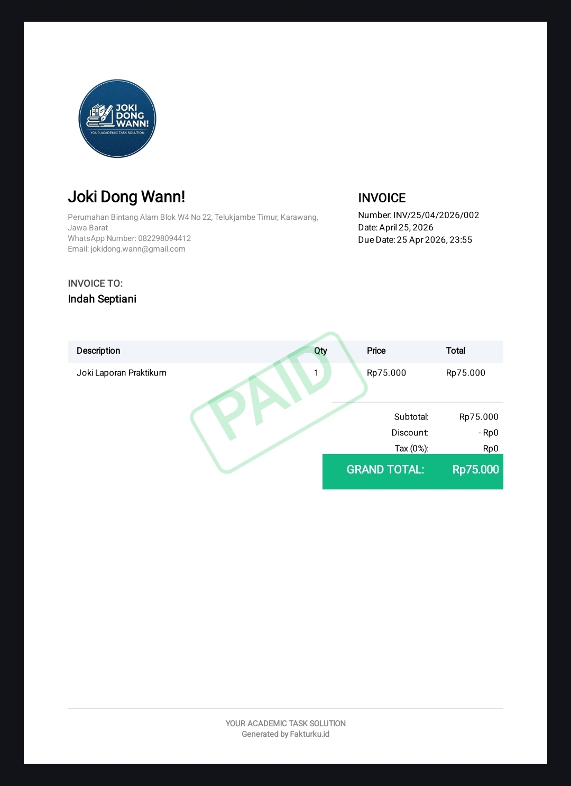

# Fakturku.id - Premium Invoicing Solution 🚀

**Fakturku.id** is a professional-grade Android invoicing application designed for SMEs and entrepreneurs. It provides a seamless, premium experience for managing invoices, tracking revenue, and maintaining customer relationships with a focus on data security and internationalization.


## ✨ Key Features

- **📄 Professional PDF Generation**: Create formal invoices with custom branding, automatic tax calculations, and localized labels.
- **📊 Real-time Analytics**: Visualized revenue trends, status distribution, and "Best Day" performance metrics.
- **🌐 Global Multi-Language Support**: Fully localized in **Indonesian, English, Japanese, and Chinese**.
- **👥 Smart Customer Management**: Membership system with automatic discount logic and detailed transaction history.
- **☁️ Secure Cloud Backup**: Automated data synchronization using Firebase for peace of mind.
- **📱 WhatsApp Integration**: One-click invoice sharing and automated payment reminders via WhatsApp.
- **🔒 Security First**: Integrated App Lock using Android Biometrics and local database encryption.

## 🛠️ Technology Stack

- **Language**: Kotlin
- **UI Framework**: Jetpack Compose (Modern Declarative UI)
- **Architecture**: MVVM (Model-View-ViewModel)
- **Database**: Room Persistence Library (with multi-version migrations)
- **Dependency Injection**: Koin
- **Backend**: Firebase (Auth, Firestore, Storage)
- **Reporting**: Native Android Canvas PDF Generation
- **Asynchronous**: Kotlin Coroutines & Flow

## 📸 Screenshots

| Dashboard | Create Invoice | Analytics |
| :---: | :---: | :---: |
|  |  |  |

| Customers | PDF Result |
| :---: | :---: |
|  |  |

## 🚀 Getting Started

1. **Clone the repository**:
   ```bash
   git clone https://github.com/yourusername/Fakturku.id.git
   ```
2. **Setup Firebase**:
   - Create a new project in Firebase Console.
   - Add an Android App with package name `com.fakturkuid.app`.
   - Download `google-services.json` and place it in the `composeApp/` directory.
3. **Build & Run**:
   - Open the project in Android Studio.
   - Sync Gradle and run on an emulator or physical device.

## 📄 License

This project is licensed under the MIT License - see the [LICENSE](LICENSE) file for details.

---
Developed with ❤️ by **Ridwan** for Professional Portfolio.
